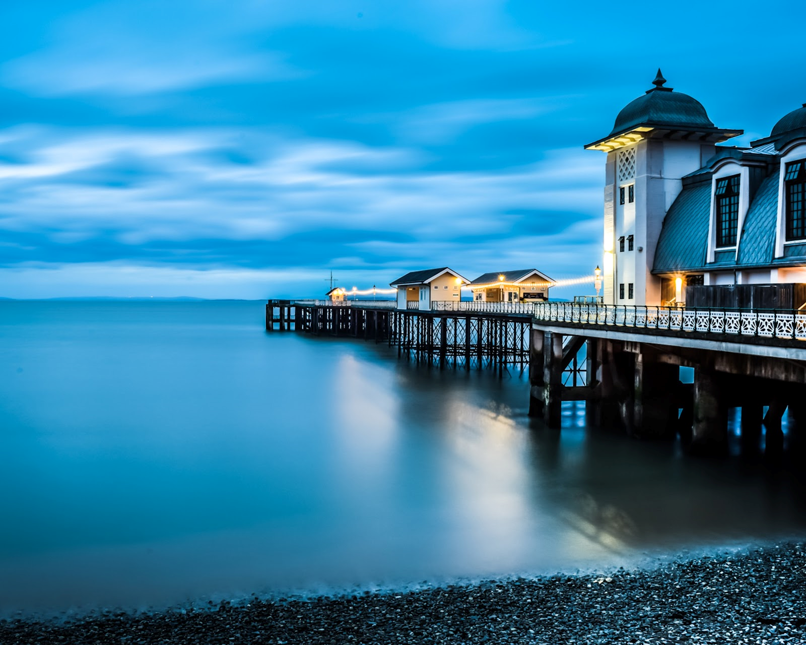

# Oil painting Effect of Realistic Digital Image 

Simulating artistic abstractions of real-life images has become widely popular in the world of photoshop and digital image processing. This is known as non-photorealistic rendering (NPR) which is concerned with giving artistic effects to realistic photos. 

Our work is based on generating oil paintings of images using a Kuwahara filtering technique. A kuwahara filter is an edge- preserving smoothing non-linear filter that generates color blocks that resemble the blocky texture of oil paintings. These color blocks are generated by calculating the variance of the neighbouring pixel values of any given pixel and replacing it with the mean of the region with the minimum variance. This not only generates the sought after blocky effect but does an excellent job of preserving the edges of the shapes in an image giving it the resemblance of an oil painting.

  
 

    <em>Image that we want to convert into an oil painting</em>

  
 

    <em>Oil Painting</em>

[To find out more about this project, please check report](./report.pdf)

